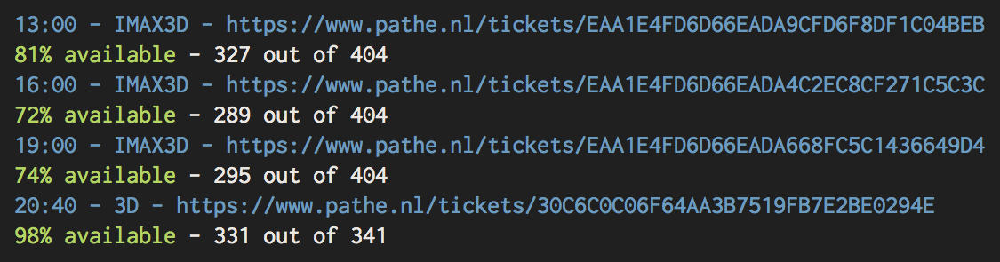
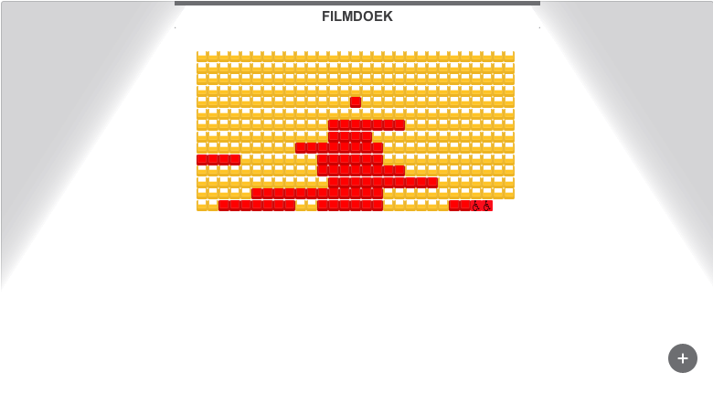

# Pathe seats finder

Because browsing the pathe.nl website for seats takes way to much time.

## Usage

Command options.

```
ruby pathe.rb --help
```

Start searching.

```
ruby pathe.rb --city=rotterdam --date=1-1-2016 --movieid=19723
```

Look for movies starting after `18` hours(6PM).

```
ruby pathe.rb --city=rotterdam --date=1-1-2016 --hour=18 --movieid=19723
```

### Output



### Screencaps

Seat screencaps will be stored in `/screencaps`.


